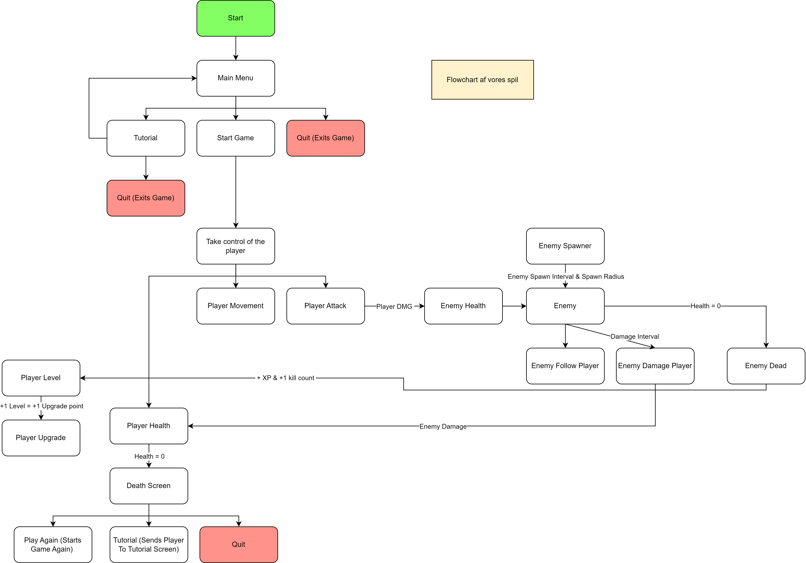

# Eksamensopgave - Programering B - 2024
Hansenberg Tekniske Gymnasium

Gruppe 1: Casper B, Mihnea og Samuel.

## Projektbeskrivelse
Vi valgt lave et nyt spil til vores eksamensprojekt. Dette er fordi vi synes at det game var for kompliceret, og at starte på et nyt ville give os bedre struktur på arbejdet og gøre det nemmere at videreudvikle. Det nye spil vil være en form for RPG, inspireret af andre titler så som Diablo, Realm of the mad god Exalt, etc. 

Før opgaven startede, har vi lavet genneralle assets til vores spil. Vi har lavet animationer til Player, men ingen funktionaliteter. Vi har også lavet et Tile set til vores spil, og et lille test map. 

Målet er at lave et singleplayer spil med en main player. Spillerens mål er at dræbe monstre, level up, blive stærkere og øge sin score. 
Spilleren bevæger sig rundt på et fixed map som vi selv laver, hvor der er plads til at lave forskellige forhindringer.
## Det vi har nået

|     Funktion    |     Navn                        |     Beskrivelse                                                                                            |     Person              |
|-----------------|---------------------------------|------------------------------------------------------------------------------------------------------------|-------------------------|
|     F1          |     Player                      |     Karakteren som spilleren bruger                                                                        |                         |
|     F1.1        |     Animationer til movement    |     Animationer som spiller når man bevæger sig (Casper lavede- og Samuel   implementerede animationer)    |     Casper og Samuel    |
|     F1.2        |     Health                      |     Spillerens liv                                                                                         |     Casper              |
|     F1.3        |     Attack                      |     Player skyder, hvor spiller kliker                                                                     |     Mihnea              |
|     F1.4        |     Stats                       |     Øge health, damage eller andet                                                                         |     Mihnea              |

|     F.2       |     Enemy            |     Fjenden som spilleren skal bekæmpe               |               |
|---------------|----------------------|------------------------------------------------------|---------------|
|     F2.1      |     Spawn            |     Enemy spawns fra spawner                         |     Casper    |
|     F2.2.2    |     Taking damage    |     Enemy modtager damage                            |     Mihnea    |
|     F2.3      |     Tracking         |     Enemy følger efter player                        |     Mihnea    |
|     F2.4      |     Enemy Health     |     Enemy health                                     |     Casper    |
|     F2.5      |     Enemy Attack     |     Enemy attack, basisk on-contact   deal damage    |     Casper    |

|     F3      |     UI               |     Alt spillets interface                                                               |               |
|-------------|----------------------|------------------------------------------------------------------------------------------|---------------|
|     F3.1    |     HP bar           |     Viser HP man har                                                                     |     Mihnea    |
|     F3.2    |     Kills            |     Enemy kills                                                                          |     Mihnea    |
|     F3.3    |     Main Menu        |     Main menu viser tutorial, settings og start game                                     |     Samuel    |
|     F3.4    |     Dead Menu        |     Menu efter du dør, her kan du vælge main menu eller respawn                          |     Samuel    |
|     F3.5    |     Tutorial         |     Tutorial screen som forklarer spillets keybinds og funktioner                        |     Samuel    |
|     F3.6    |     Stats Upgrade    |     Stats menu til player, herunder mulig upgrade (dmg, health, speed   upgrade etc.)    |     Mihnea    |

## Video af spillet

## Link til spillet
https://play.unity.com/mg/other/webgl-builds-396758

## Flowchart af vores spil

